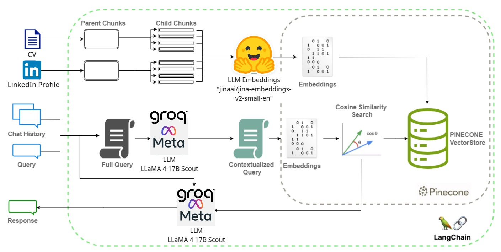
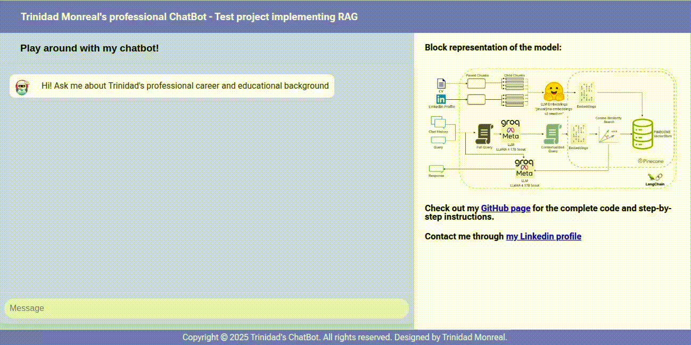

# 💬 Trinidad Monreal's Professional ChatBot — RAG-based CV Assistant

This is a test project implementing **Retrieval-Augmented Generation (RAG)** to answer questions about **Trinidad Monreal's professional background**. It combines information from her **CV** and **LinkedIn profile**, using LangChain, Pinecone, and Groq's **LLaMA 4 17B Scout**.

---

## 🧠 How It Works

1. CV and LinkedIn PDF are parsed and chunked.
2. Embeddings are generated using [`jinaai/jina-embeddings-v2-small-en`](https://huggingface.co/jinaai/jina-embeddings-v2-small-en) via Hugging Face.
3. Vectors are stored in Pinecone.
4. A user query is embedded and matched with the most relevant chunks using cosine similarity.
5. The matched context and query are sent to Groq’s LLaMA 4 model for a final answer.

### 📊 Architecture Diagram



---

## 🚀 Running the App Locally

### 1. Clone the repo and set up your environment

```bash
git clone https://github.com/tmonreal/professional-chatbot.git
cd professional-chatbot
python3 -m venv .venv
source .venv/bin/activate  # On Windows: .venv\Scripts\activate
pip install -r requirements.txt
```

### 2. Create a `.env` file

```env
PINECONE_API_KEY=your_pinecone_key
PINECONE_REGION=us-east-1
PINECONE_CLOUD=aws
GROQ_API_KEY=your_groq_api_key
```

### 3. Build the index (only once or when documents change)

```bash
python index_builder.py
```

### 4. Run the web app

If your file is named app.py, Flask will detect it automatically. Otherwise, export it:

```bash
export FLASK_APP=app.py
flask run
```

Then open http://127.0.0.1:5000 in your browser to view and interact with the chatbot.


## Project Structure

| File               | Description                                                                 |
|--------------------|-----------------------------------------------------------------------------|
| `app.py`           | The main Flask app that serves the chatbot interface and handles requests.  |
| `llm_engine.py`    | Loads the LLM, embeddings, and retriever (used at runtime by the app).      |
| `index_builder.py` | Script to process, chunk, embed, and upload your CV + LinkedIn to Pinecone. |
| `embeddings.py`    | Wrapper for the Jina AI embedding model loaded via Hugging Face.            |
| `utils.py`         | Helper functions for document loading and section-based chunking.           |
| `init.py`          | Original prototype file used to test the full pipeline (no longer needed).  |
| `test_qa.py`       | Script for manually testing the QA chain outside of the Flask interface.    |
| `templates/`       | Contains `index.html`, the chatbot's front-end.                              |

## Demo

🎥 Watch the demo video below:




Or download it directly:

[](demo/demo-chatbot.mp4)

## Credits

- Embedding model by [Jina AI](https://huggingface.co/jinaai)
- LLM powered by [Groq](https://groq.com), based on [Meta's LLaMA 4](https://ai.meta.com/llama/)
- Vector similarity search by [Pinecone](https://www.pinecone.io)
- Built using [LangChain](https://www.langchain.com) and [Flask](https://flask.palletsprojects.com)
